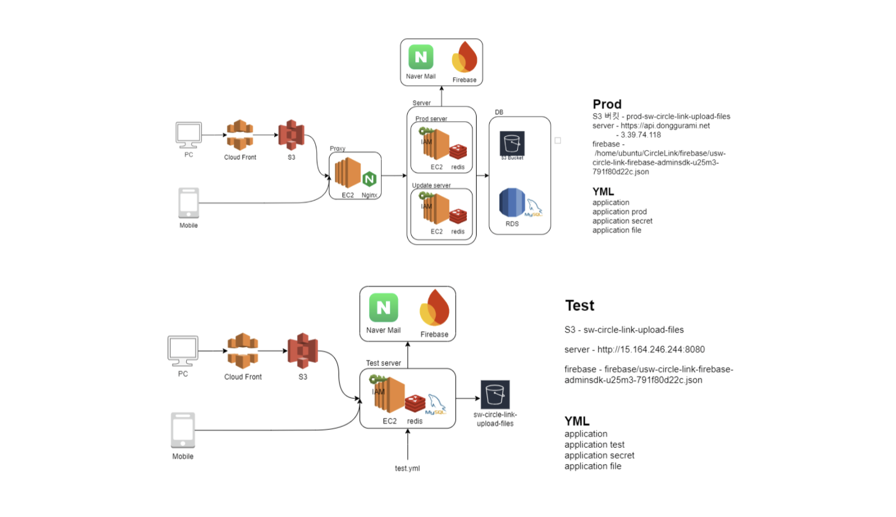
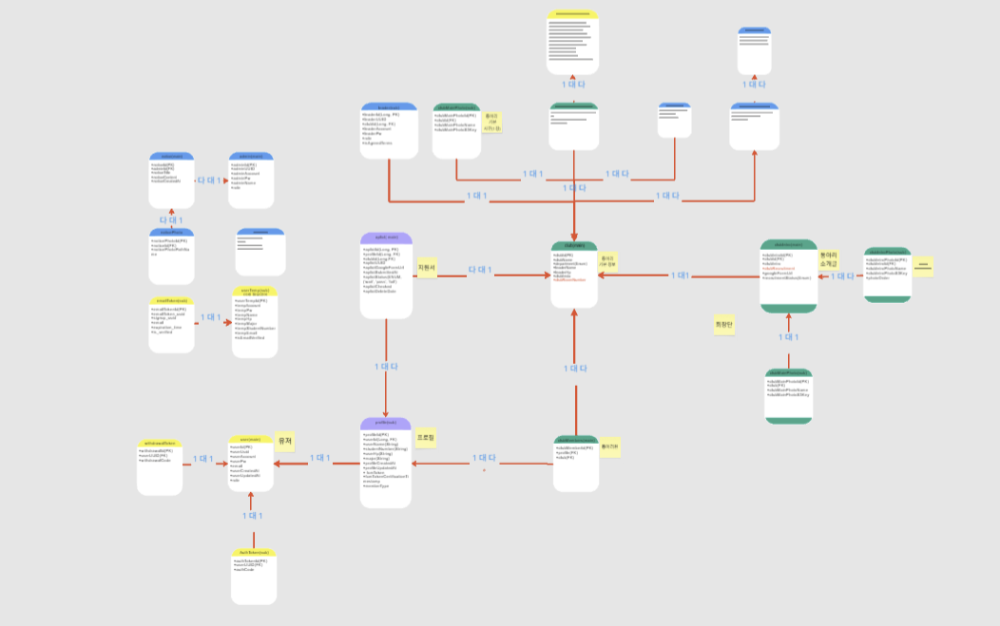

<p align="center">
  
</p>

<h1 align="center">동구라미</h1>
<p align="center">수원대학교 동아리 연합회 공식 플랫폼</p>

<p align="center">
  <a href="https://admin.donggurami.net">웹 서비스</a> ·
  <a href="https://apps.apple.com/kr/app/%EB%8F%99%EA%B5%AC%EB%9D%BC%EB%AF%B8/id6692607046">iOS</a> ·
  <a href="https://play.google.com/store/apps/details?id=com.usw.flag.temp.usw_circle_link">Android</a> ·
  <a href="https://linktr.ee/woochang4862">시연 영상</a>
</p>

---

## 목차

1. [프로젝트 개요](#1-프로젝트-개요)
2. [성과](#2-성과)
3. [기술 스택](#3-기술-스택)
4. [시스템 설계](#4-시스템-설계)
5. [담당 영역](#5-담당-영역)
6. [테스트](#6-테스트)
7. [트러블슈팅](#7-트러블슈팅)

---

## 1. 프로젝트 개요

동구라미는 수원대학교 동아리 연합회의 공식 통합 관리 플랫폼입니다. 기존에 카카오톡·엑셀로 분산 관리되던 동아리 정보와 지원 프로세스를 디지털화했습니다.  

- **기간:** 2024년 4월 ~ 2025년 3월 (약 12개월)
- **팀 구성:** 백엔드 4명 / 웹 프론트엔드 4명 / 모바일(iOS·Android) 3명 / 디자인 1명

**해결한 문제**
- 동아리별 개별 홍보로 인한 정보 분산 → 단일 플랫폼에서 전체 동아리 탐색
- 종이/구글폼 기반 지원서 관리 → 실시간 지원 현황 조회 및 결과 알림(FCM)
- 행사 당일 소속 인원 수기 확인 → QR 기반 디지털 식별

**서비스 링크**

| 플랫폼 | 링크 | 상태 |
|--------|------|------|
| 웹 (권장) | [admin.donggurami.net](https://admin.donggurami.net) | 운영 중 |
| iOS | [App Store](https://apps.apple.com/kr/app/%EB%8F%99%EA%B5%AC%EB%9D%BC%EB%AF%B8/id6692607046) | 운영 중 |
| Android | [Google Play](https://play.google.com/store/apps/details?id=com.usw.flag.temp.usw_circle_link) | 운영 중 |

**주요 기능**

| 기능 | 설명 | 웹 | iOS | Android |
|------|------|:--:|:---:|:-------:|
| 동아리 탐색 | 카테고리·모집상태 필터 및 상세 정보 조회 | ✓ | ✓ | ✓ |
| 지원서 제출 | 중복 방지 및 실시간 지원 현황 확인 | ✓ | ✓ | ✓ |
| 합격 알림 | FCM 기반 합격/불합격 푸시 알림 | - | ✓ | ✓ |
| 회원 관리 | 엑셀 업로드 및 정회원/비회원 분류 | ✓ | ✓ | ✓ |
| 프로필 관리 | 프로필 수정 및 소속 동아리 조회 | ✓ | ✓ | ✓ |

---

## 2. 성과

2025년 10월 30일 동아리 축제 입장 식별 시스템으로 실서비스 적용됐습니다.  

| 지표 | 수치 |
|------|------|
| 일일 활성 사용자 (출시 당일) | 0명 → **249명** |
| 누적 가입자 수 | **498명** |
| 주간 활성 사용자 | **618명** |
| 월간 활성 사용자 | **772명** |

> 동아리 연합회 측으로부터 "기존 수기 확인 방식보다 원활하게 진행됐다"는 평가를 받았고 다수 동아리 회장으로부터 "기존 문제점이 잘 해결됐다"는 피드백을 받았습니다.  

---

## 3. 기술 스택

### Backend
| 기술 | 선택 이유 |
|------|-----------|
| Spring Boot 3.3.1 | 검증된 생태계와 자동 설정으로 빠른 개발이 가능하고 Spring Security 통합이 용이 |
| Spring Security | 필터 기반 인증 체계를 역할별로 분리하기 위한 표준 프레임워크 |
| Spring Data JPA | 도메인 중심 설계와 JPQL 벌크 연산을 혼용해 유지보수성과 성능을 균형 있게 확보 |

### Database
| 기술 | 선택 이유 |
|------|-----------|
| MySQL 8.0 | 복잡한 조인·페이징·트랜잭션이 필요한 관계형 데이터에 적합 |
| Redis | Refresh Token 저장소(TTL 자동 만료) 및 Rate Limiter(Bucket4j) 분산 상태 관리 |

### 인증 / 보안
| 기술 | 선택 이유 |
|------|-----------|
| JWT (jjwt) | Stateless 인증으로 수평 확장에 유리하고 role claim으로 토큰 검증 직후 인증 주체 확정 가능 |
| Bucket4j + Redis | 분산 환경에서도 동일한 Rate Limit 정책 적용 가능 |
| Jsoup | XSS 방지를 위한 입력 정제를 `@Sanitize` 어노테이션으로 선언적으로 적용 |

### 인프라
| 기술 | 선택 이유 |
|------|-----------|
| AWS EC2 | 서버 환경 제어 및 IAM 역할 기반 자격증명으로 키 없는 S3 접근 |
| AWS RDS | 자동 백업과 멀티 AZ로 데이터 내구성 확보 |
| AWS S3 + Presigned URL | 파일 트래픽을 서버가 직접 처리하지 않고 클라이언트가 S3와 직접 통신하도록 분리 |
| Nginx | 리버스 프록시 및 SSL 터미네이션 |

### 외부 연동
- Firebase FCM — 합격/불합격 결과 푸시 알림 (iOS·Android)
- Naver SMTP — 이메일 인증 / 아이디 찾기 / 비밀번호 재설정

---

## 4. 시스템 설계

### 서버 구성도


### ERD


### API 명세서
- [[모바일(User) API]](https://documenter.getpostman.com/view/36800939/2sA3s1nrcY)
- [[웹(Leader/Admin) API]](https://documenter.getpostman.com/view/29405740/2sA3s6Doda)

---

## 5. 담당 영역

인증/인가, 동아리·지원서·공지 기능, 공통 예외 처리, 파일 업로드 검증, 입력 정제를 담당했습니다.  

### 인증/인가 구조

**설계 의도:** User·Leader·Admin 세 역할의 인증 흐름을 공통화하되 역할별 조회 책임은 분리해 OCP를 준수했습니다.  

```
RoleBasedUserDetailsService (interface)
├── CustomUserDetailsService    → Role.USER
├── CustomLeaderDetailsService  → Role.LEADER
└── CustomAdminDetailsService   → Role.ADMIN

UserDetailsServiceManager
└── EnumMap<Role, RoleBasedUserDetailsService>  → O(1) 조회
```

- JWT Access Token에 `role` claim 포함 → 토큰 검증 직후 인증 대상 확정, JwtFilter에서 역할 판단 로직 제거
- Refresh Token은 `RefreshTokenStore`(Redis 읽기·쓰기) / `RefreshTokenCookieService`(쿠키 처리) / `RefreshTokenService`(발급·검증·재발급) 세 클래스로 책임 분리
- 로그아웃·비밀번호 변경 시 Redis에서 Refresh Token 즉시 무효화
- Bucket4j + Redis로 로그인·이메일 발송 등 민감 API에 Rate Limiting 적용 (`@RateLimite` AOP)

### 동아리 관련 기능

**설계 의도:** 동아리 삭제 시 연관 엔티티가 9개에 달해 쿼리 수 최소화와 S3 일관성 보장을 중심으로 설계했습니다.  

- `deleteClubAndDependencies()` — JPQL 벌크 DELETE로 테이블당 쿼리 1개로 처리
- `TransactionSynchronizationManager.registerSynchronization().afterCommit()` — DB 커밋 이후에만 S3 삭제 실행해 두 저장소 간 불일치 방지
- 동아리 회원 엑셀 업로드 시 이름·학번·전화번호 Set 기반 단일 쿼리 중복 확인

### 지원서 기능

**설계 의도:** 애플리케이션 레벨 검증만으로는 동시성 문제를 완전히 막을 수 없어 DB 레벨 보장을 추가했습니다.  

- `ClubApplication` 엔티티에 `(profile_id, club_id)` 복합 유니크 제약 추가
- `saveAndFlush()`로 커밋 전 즉시 플러시 → `DataIntegrityViolationException`을 `ALREADY_APPLIED`로 변환
- 비관적 락·Redis 분산 락은 서비스 규모 대비 복잡도가 과하다고 판단해 미채택

### 파일 업로드 검증

**설계 의도:** 확장자 스푸핑으로 악성 파일이 S3에 업로드되는 문제를 서버에서 원천 차단합니다.  

- `FileSignatureValidator` — 파일 헤더 바이트(매직 넘버)를 직접 읽어 확장자와 실제 포맷 일치 여부 검증
- PNG는 스펙에서 정의한 8바이트 시그니처 전체 검증
- S3 업로드는 Presigned URL 방식으로 처리해 파일 트래픽이 서버를 경유하지 않음

### 입력 검증 및 정제

**설계 의도:** 검증 로직을 서비스 계층에서 분리해 재사용성을 높이고 XSS를 선언적으로 방어합니다.  

- `@ValidClubRoomNumber` — 유효한 동아리방 번호 집합(Set)과 정규식을 결합한 커스텀 검증
- `@Sanitize` + `SanitizationBinder` — `@ControllerAdvice` + `WebDataBinder`로 모든 String 입력을 Jsoup으로 정제해 XSS 차단

### 공통 예외 처리

**설계 의도:** `GlobalExceptionHandler`에서 4xx/5xx를 구분해 운영 환경에서는 4xx 로그를 생략하고 예외 응답 구조를 통일합니다.  

- `@RestControllerAdvice`로 전역 예외를 한 곳에서 처리
- 운영 프로파일(`prod`)에서는 4xx 클라이언트 에러 로그를 출력하지 않아 노이즈 감소
- UUID 파싱 실패, JSON 역직렬화 오류, 파일 크기 초과 등 Spring 내부 예외도 일관된 형식으로 반환

---

## 6. 테스트

### 테스트 구성

총 **22개 테스트 클래스**, **166개 테스트 케이스**를 작성했습니다.  

| 유형 | 클래스 수 | 주요 내용 |
|------|-----------|-----------|
| Service (단위) | 6 | Mockito 기반 비즈니스 로직·예외 분기 검증 |
| Repository (통합) | 4 | `@DataJpaTest` JPQL 커스텀 쿼리·벌크 DELETE 실행 검증 |
| Controller (슬라이스) | 3 | `@WebMvcTest` HTTP 상태코드·응답 본문 검증 |
| Security | 5 | JWT 발급·검증·만료, JwtFilter 동작, RefreshToken 생명주기 |
| Validator | 2 | 파일 시그니처 검증, 동아리방 번호 유효성 |
| 기타 | 2 | `UserDetailsServiceManager` EnumMap 조회, `IntegrationAuthService` |

### 테스트 전략

**단위 테스트(Service):** 외부 의존성을 Mockito로 모킹해 비즈니스 로직에만 집중합니다. `MockedStatic`으로 `SecurityContextHolder`를 격리해 인증 컨텍스트를 제어합니다.  

```java
// 예: 동시성 - DB 유니크 제약 위반을 도메인 예외로 변환
given(clubApplicationRepository.saveAndFlush(any()))
    .willThrow(new DataIntegrityViolationException("unique constraint"));

assertThatThrownBy(() -> service.submitClubApplication(clubUUID))
    .isInstanceOf(ClubApplicationException.class)
    .extracting(e -> ((ClubApplicationException) e).getExceptionType())
    .isEqualTo(ExceptionType.ALREADY_APPLIED);
```

**통합 테스트(Repository):** `@DataJpaTest`로 실제 JPA 쿼리를 검증합니다. `deleteClubAndDependencies()` 테스트에서는 `MockedStatic<TransactionSynchronizationManager>`를 활용해 `afterCommit()` 콜백 등록 여부와 S3 삭제 호출 순서를 분리 검증합니다.  

```java
// 예: 커밋 후 S3 삭제 보장 검증
mocked.verify(() -> TransactionSynchronizationManager
    .registerSynchronization(synchronizationCaptor.capture()));

synchronizationCaptor.getValue().afterCommit();  // 직접 afterCommit 트리거
then(s3FileUploadService).should().deleteFiles(List.of(INTRO_S3_KEY, MAIN_S3_KEY));
```

**슬라이스 테스트(Controller):** `@WebMvcTest` + `addFilters = false`로 Security 필터를 제거하고 HTTP 레이어만 검증합니다. MockMvc로 상태코드, 응답 JSON 구조, 예외 코드를 단언합니다.  

```java
mockMvc.perform(get("/apply/can-apply/{clubUUID}", clubUUID))
    .andExpect(status().isOk())
    .andExpect(jsonPath("$.message").value("지원 가능"))
    .andExpect(jsonPath("$.data").doesNotExist());
```

**Security 테스트:** 유효·만료·변조 토큰 세 케이스를 각각 검증하고 JwtFilter에서 각 케이스에 따라 `CustomAuthenticationEntryPoint`가 올바른 에러 코드로 호출되는지 `ArgumentCaptor`로 확인합니다.  

---

## 7. 트러블슈팅

### 7-1. 동아리 삭제 최적화와 S3 스토리지 누수 방지 · [블로그](https://velog.io/@bh1848/%EB%8F%99%EC%95%84%EB%A6%AC-%EC%82%AD%EC%A0%9C-%EC%B5%9C%EC%A0%81%ED%99%94%EC%99%80-S3-%EC%8A%A4%ED%86%A0%EB%A6%AC%EC%A7%80-%EB%88%84%EC%88%98-%EB%B0%A9%EC%A7%80)

**문제**  
동아리 삭제 시 연관 테이블(ClubMembers, ClubApplication, ClubIntroPhoto 등 9개)을 레포지토리별로 개별 삭제하면서 쿼리가 선형으로 증가했다. JPA `deleteAll()`은 대상을 먼저 조회한 뒤 건별 DELETE를 실행하기 때문에 데이터가 많아질수록 쿼리 수가 늘어나는 구조였다. 또한 S3 삭제가 트랜잭션 범위 밖에서 실행되어 DB 삭제는 성공했는데 S3 파일이 남거나 그 반대 상황이 생길 수 있었다.  

**해결**  
`deleteClubAndDependencies()`를 별도 메서드로 분리하고 JPQL 벌크 DELETE로 연관 테이블을 테이블당 쿼리 1개로 처리했다. S3 삭제는 `TransactionSynchronizationManager.registerSynchronization()`의 `afterCommit()`으로 트랜잭션 커밋 이후에만 실행되도록 보장했다. 롤백 시 S3 삭제가 실행되지 않아 두 저장소 간 불일치를 막았다. 같은 패턴을 `AdminNoticeService.deleteExistingPhotos()`에도 동일하게 적용했다.  

| 항목 | 변경 전 | 변경 후 |
|------|---------|---------|
| 삭제 쿼리 수 | 테이블당 N개 | 테이블당 1개 |
| S3-DB 불일치 | 삭제 실패 시 발생 가능 | 커밋 후 S3 삭제 보장 |

**한계와 트레이드오프**  
`afterCommit()`으로 DB 커밋 이후 S3 삭제를 보장했지만 S3 삭제 자체가 실패하는 경우(네트워크 오류, S3 장애)는 막지 못한다. 완전한 해결을 위해서는 실패한 S3 키를 별도로 기록하고 재시도하는 방식이 필요하지만 현재 서비스 규모에서는 이 수준으로 충분하다고 판단했다.  

---

### 7-2. JPA saveAndFlush와 DB 유니크 제약으로 동시성 문제 해결하기 · [블로그](https://velog.io/@bh1848/%EC%A7%80%EC%9B%90%EC%84%9C-%EC%A4%91%EB%B3%B5-%EC%A0%9C%EC%B6%9C%EA%B3%BC-%EA%B2%BD%EC%9F%81-%EC%83%81%ED%83%9C-%EC%B2%98%EB%A6%AC)

**문제**  
`checkIfCanApply()`(readOnly 트랜잭션)와 `submitClubApplication()`이 별도 트랜잭션으로 분리된 구조에서 동시 요청이 둘 다 검증을 통과해 중복 지원서가 저장될 수 있었다. 애플리케이션 레벨 검증만으로는 동시성 문제를 완전히 막을 수 없었다.  

**해결**  
`ClubApplication` 엔티티에 `(profile_id, club_id)` 복합 유니크 제약을 추가해 DB 레벨에서 중복 저장을 차단했다. 제약 이름을 명시(`uk_club_application_profile_club`)해 에러 로그에서 어떤 제약 위반인지 즉시 식별할 수 있도록 했다. `save()` 대신 `saveAndFlush()`를 사용해 트랜잭션 커밋 전에 즉시 플러시하고 `DataIntegrityViolationException`을 `try-catch` 안에서 잡아 `ALREADY_APPLIED`로 변환했다. JPA는 기본적으로 커밋 시점에 플러시하기 때문에 `save()`를 쓰면 예외가 `try-catch` 바깥에서 터질 수 있어 `saveAndFlush()`가 필수였다.  

비관적 락은 매 지원마다 락을 거는 비용이 발생하고 Redis 분산 락은 단일 서버 환경에서 불필요한 인프라 복잡도를 추가하므로 채택하지 않았다. 동아리 지원이 동시에 폭발적으로 몰리는 상황이 없는 서비스 규모에서는 DB 유니크 제약으로 충분하다고 판단했다.  

`checkIfCanApply()`에서 전화번호·학번 중복을 검사하던 두 번의 순회도 하나의 루프로 통합해 불필요한 반복을 제거했다.  

---

### 7-3. Spring Security UserDetailsService 분리와 JWT Access Token 설계 · [블로그](https://velog.io/@bh1848/Spring-Security-UserDetailsService-%EB%B6%84%EB%A6%AC%EC%99%80-JWT-Access-Token-%EC%84%A4%EA%B3%84)

**문제**  
User·Leader·Admin 세 역할의 인증 대상 조회가 단일 메서드 분기로 처리되어 역할 추가 시마다 해당 메서드를 수정해야 했다. Access Token에 `role`이 없어 토큰 검증 후에도 어떤 `UserDetailsService`를 써야 할지 필터에서 다시 판단해야 했고 인증 필터에 역할 판단 로직이 끼어들어 책임이 불명확했다.  

**해결**  
`RoleBasedUserDetailsService` 인터페이스를 정의하고 역할별 구현체로 분리했다. `UserDetailsServiceManager`가 `EnumMap`으로 역할에 맞는 구현체를 O(1)로 선택하도록 구성해 역할 추가 시 기존 코드를 건드리지 않아도 되는 구조를 만들었다. `EnumMap`을 선택한 이유는 `Role`이 열거형이라 키 범위가 고정되어 있고 내부적으로 배열 기반으로 동작해 `HashMap`보다 메모리 효율이 좋기 때문이다.  

Access Token에 `role` claim을 추가해 토큰 검증 직후 인증 대상을 확정할 수 있게 했고 `JwtFilter`에서 역할 판단 로직을 제거했다. JWT 페이로드는 Base64로 인코딩될 뿐 암호화되지 않으므로 UUID와 역할 값만 담아 노출 범위를 최소화했다.  

Refresh Token은 `RefreshTokenStore`(Redis 읽기·쓰기) / `RefreshTokenCookieService`(쿠키 처리) / `RefreshTokenService`(발급·검증·재발급) 세 클래스로 책임을 분리했다. `RefreshTokenStore`에서 `refreshToken:token:{token}`과 `refreshToken:user:{uuid}` 두 가지 키를 함께 관리하는 이유는 "토큰 → 세션"과 "UUID → 토큰" 양방향 조회가 모두 필요하기 때문이다. 키를 하나만 쓰면 한쪽 방향은 전체 스캔이 필요해지므로 저장 공간을 두 배로 쓰는 대신 두 방향 조회를 모두 O(1)로 처리하도록 했다.  

| 항목 | 변경 전 | 변경 후 |
|------|---------|---------|
| 인증 대상 확정 시점 | 토큰 검증 후 역할 재확인 | 토큰 검증 직후 확정 |
| 역할별 조회 책임 | 단일 메서드 분기 | 구현체별 분리 (OCP 준수) |
| Refresh Token 책임 | 단일 클래스 집중 | Store / Cookie / Service 분리 |

---

### 7-4. 파일 업로드 검증 강화와 매직 바이트 도입 · [블로그](https://velog.io/@bh1848/%ED%8C%8C%EC%9D%BC-%EC%97%85%EB%A1%9C%EB%93%9C-%EA%B2%80%EC%A6%9D-%EA%B0%95%ED%99%94%EC%99%80-%EB%A7%A4%EC%A7%81-%EB%B0%94%EC%9D%B4%ED%8A%B8-%EB%8F%84%EC%9E%85)

**문제**  
파일명 기반 확장자 검사만으로는 실제 파일 포맷을 보장할 수 없었다. 실제 포맷과 확장자가 다른 파일이 업로드됐을 때 S3에는 정상적으로 올라갔지만 클라이언트에서 이미지가 표시되지 않았다. 업로드 자체는 성공했으니 서버 로그에도 오류가 없어 원인을 찾는 데 시간이 걸렸다.  

**해결**  
파일 포맷은 헤더에 고유한 매직 바이트를 가지고 있다는 점을 활용해 `FileSignatureValidator`를 별도 클래스로 분리했다. 확장자별 시그니처를 정의하고 `InputStream`에서 바이트를 직접 읽어 비교했다. PNG만 8바이트를 읽는 이유는 PNG 스펙이 시그니처를 8바이트(`89 50 4E 47 0D 0A 1A 0A`)로 정의하고 있기 때문이다. 4바이트만 읽어도 다른 포맷과 구별은 되지만 스펙에서 정의한 시그니처 전체를 검증하는 것이 더 정확하다고 판단했다. 확장자 검사 이후 시그니처 검사를 추가로 실행해 이미지 표시 문제를 해결하고 확장자 스푸핑을 통한 악성 파일 업로드도 차단했다.